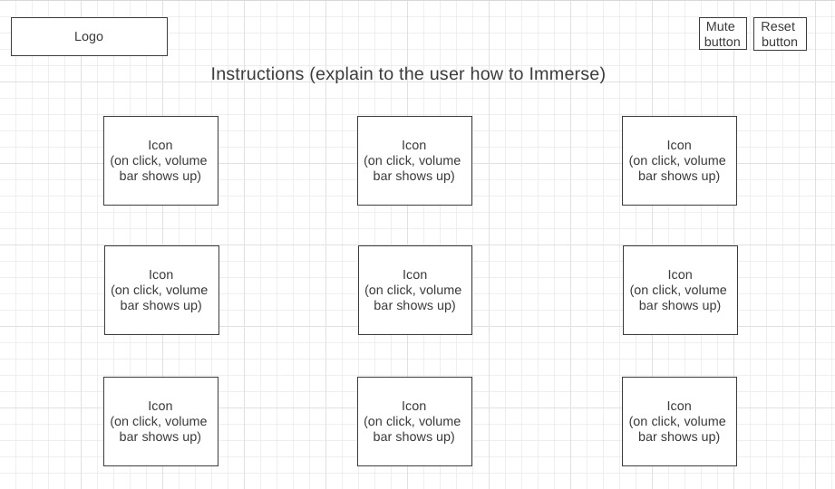

# Welcome to Immerse!

<p align="center">
    <a href="https://michellenaim.github.io/immerse/" target="_blank">
        
    </a>
</p>

###### [Live Site](https://michellenaim.github.io/immerse/)

## Table of Contents

  * [About Immerse](#about-immerse)
  * [Technologies](#technologies)
  * [Features](#features)
    * [Sounds](#sounds)
        * [Play/Pause]
        * [Mute/Reset]
    * [Sounds (mute/reset)](#movie-trailers-index)
    * [Background color](#genre-show)
    
    
## About Immerse

Immerse is a web app that allows users to blend different sounds to create a perfect ambiance while working or relaxing. Once users click on one of the icons, the sound will start playing and the background color will change. Users can add many different sounds by clicking on different icons and adjusting the volume level of each. If users click on different icons, the background colors will blend. If users click on an icon to remove the sound, its background color will also be removed from the blend.

Immerse was built using Vanilla JavaScript, HTML and CSS.

<p align="center">
    <a href="https://michellenaim.github.io/immerse/" target="_blank">
        
    </a>
</p>

## Technologies

* JavaScript
* HTML
* CSS

## Features

#### Sounds

+ Play/Pause
    * Users can click on icons to play different sounds.
    * When the user clicks on an icon, a volume slider will appear below it and the user will be able to adjust the sound.
    * Users can click again on an icon to stop a specific sound from playing.
    * There is a default low sounds for all icons.
    
```javascript
icon.addEventListener("click", function(event) {
    if (audio.paused) {
        audio.loop = true;
        volumeSlider.value = 0.1
        audio.volume = volumeSlider.value
        audio.play();
        icon.children[0].classList.add('playing');
        volumeSlider.classList.add('playing');

        // add different background colors
        classes.push(icon.id);

        rgbString = computeAverage(classes);
        document.body.style = rgbString;

    } else {
        audio.pause();
        icon.children[0].classList.remove('playing');
        volumeSlider.classList.remove('playing');

        let index = classes.indexOf(icon.id);
        classes.splice(index, 1);
        rgbString = computeAverage(classes);
        document.body.style = rgbString
    }
});
```

+ Mute/Reset
    * Users can click on a mute button to mute all sounds playing on the page.
    * Users can also click on a reset button to unselect all icons that were previously selected and start from scratch.
    
```javascript
let reset = document.querySelector('.reset');

reset.addEventListener('click', function(){
    for (let i = 0; i < icons.length; i++) {
        let icon = icons[i];
        let audio = icon.nextElementSibling;
        let volumeSlider = audio.nextElementSibling;
        audio.pause();	
        icon.children[0].classList.remove('playing')
        volumeSlider.classList.remove('playing')
        classes = []
        document.body.style = 'background-color: rgb(204, 219, 234)'
    }
})
```

#### Background color

+ When users click on an icon, the background color of the page changes.
+ Each icon is assigned a different background color.
+ When users click on many different icons, the background colors blend (an average of the colors is computed to give the color shown).
+ When users unclick an icon, the background color assigned to that icon gets removed from the blend. A new blend appears with the active icons' background colors.

```javascript
function computeAverage(classes) {
    if (classes.length === 0 ) {
        return 'background-color: rgb(204, 219, 234)'
    }

    let count = 0;
    let rgb = [0,0,0]

    for (let i = 0; i < classes.length; i++) {
        count += 1
        rgb[0] += colors[classes[i]][0]
        rgb[1] += colors[classes[i]][1]
        rgb[2] += colors[classes[i]][2]
    }

    rgb[0] = rgb[0] / count
    rgb[1] = rgb[1] / count
    rgb[2] = rgb[2] / count

    return `background-color: rgb(${rgb[0]},${rgb[1]},${rgb[2]})`
}
```
