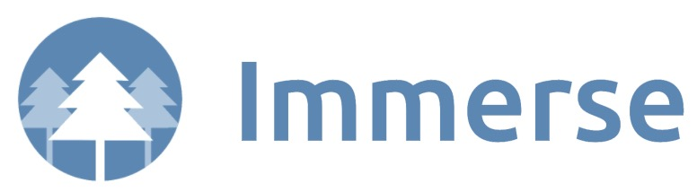

# Welcome to Immerse!

    

###### [Live Site](https://michellenaim.github.io/immerse/)

## Table of Contents

  * [About Immerse](#about-immerse)
  * [Technologies](#technologies)
  * [Features](#features)
    * [Sounds (play/pause)](#sounds(play/pause))
    * [Sounds (mute/reset)](#movie-trailers-index)
    * [Background color](#genre-show)
    
    
## About Immerse

Immerse is a web app that allows users to blend different sounds to create a perfect ambiance while working or relaxing. Once users click on one of the icons, the sound will start playing and the background color will change. Users can add many different sounds by clicking on different icons and adjusting the volume level of each. If users click on different icons, the background colors will blend. If users click on an icon to remove the sound, its background color will also be removed from the blend.

Immerse was built using Vanilla JavaScript, HTML and CSS.

## Technologies

* JavaScript
* HTML
* CSS

## Features

#### Sounds (play/pause)

#### Sounds (mute/reset)

#### Background color
